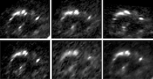

Gravitational Lensing with Image Mapping
========================================

This repository contains a number of tools to extract information about 
gravitational lenses from the mapping between multiple images.

Contents
--------

The following tools are available.

-   [**`dist`**](#dist) -
    distribution plot from samples
-   [**`immap`**](#immap) -
    map reference image using relative magnification matrices
-   [**`lens2mat`**](#lens2mat) -
    convert from lens quantities to relative magnification matrices
-   [**`mat2lens`**](#mat2lens) -
    convert from relative magnification matrices to lens quantities
-   [**`ptcrop`**](#ptcrop) -
    crop image using point definitions
-   [**`ptmatch`**](#ptmatch) -
    relative magnification matrices and lens quantities from point matching
-   [**`reg2pts`**](#reg2pts) -
    generate point definitions from SAOImage DS9 region files
-   [**`regcrop`**](#regcrop) -
    crop FITS files using SAOImage DS9 region files
-   [**`srcim`**](#srcim) -
    map observed images to source plane using lens quantities

Manual
------

### dist

distribution plot from samples

    usage: dist [-afg] [-b BINS] [-s SMOOTH] [-t TRUFILE] SAMFILE OUTFILE

The `dist` script creates a distribution plot from the samples in `SAMFILE`.
The format must match that of sample files generated by [`ptmatch`](#ptmatch)
when the `-s` flag is given. The plot is generated from an optionally smoothed
histogram and written to `OUTFILE`.

The `-afg` flags control the plotting of the anchor points (`-a`), convergence
ratios (`-f`) and reduced shears (`-g`), respectively, and at least one of
these flags must be given.

The `-b` and `-s` flags control the number and smoothing of bins, respectively.
The smoothing length `SMOOTH` is the size (in number of bins) of a Gaussian
kernel. When `SMOOTH` is zero, no smoothing is performed, and a histogram is
produced.

The `-t` option reads truth values from `TRUFILE` and marks them in the plot.
The precise layout (rows and columns) of the file does not matter, as long as
the number and order of the values agrees with the plot.

### immap

map reference image using relative magnification matrices

    usage: immap [-0] [-p PTSFILE] [-a ANCFILE] [-d PAD] MATFILE IMFITS OUTFITS

The `immap` tool reads a list of relative magnification matrices from `MATFILE`
and applies the transformation from each row to the image from `IMFITS`. The
mapped images are saved as a multi-extension FITS file in `OUTFITS`.

The matrix file must contain rows of the form `T_11 T_12 T_21 T_22`, where the
`T_ij` are the matrix entries. Each row corresponds to the magnification matrix
of one additional multiple image relative to a reference image. The output will
contain the reference image as the primary HDU (index 0), and one image-mapped
version of the reference image for each row of the matrix file, in the same
order. Hence the output file will contain one more multiple image than there
are given matrices.

If the `-0` flag is set, unmapped pixels of the output images are set to a
special null value, which is often ignored by consumers of FITS files such as
SAOimage DS9.

If the `-p` option is given, the points definition from `PTSFILE` is read,
which should be in the same format as for the [`ptmatch`](#ptmatch) tool,
although the uncertainties are ignored. The mapped images are then *cropped to
fit the provided points for each multiple image* (as opposed to the mapped
points of the reference image), plus a configurable padding, see below.

If the `-a` option is given together with `-p`, anchor points for the images
are read from `ANCFILE`. These can improve the positioning of the mapped images
within each multiple image.

The `-d` option sets the padding for mapped images which are cropped around the
points provided by the `-p` option. A positive value specifies the padding in
pixels, whereas a negative value specifies the padding as a fraction of the
bounding box of the points.

### lens2mat

convert from lens quantities to relative magnification matrices

    usage: lens2mat [-q] [-o OUTFILE] FILE

The `lens2mat` tool reads a list of convergence ratios and shears from `FILE`
and computes the corresponding relative magnification matrices.

The input file must contain rows of the form `f g1 g2`, where each row
corresponds to one multiple image. The first row is the reference image for
which the relative magnification matrices are computed. All values of `f` are
normalised by the value given for the reference image, which can differ from
unity.

The relative magnification matrices are printed as `T_11 T_12 T_21 T_22`, where
`T_ij` are the matrix entries. The total number of rows will be one less than
the number of images, because the transformations are relative to the reference
image.

If the `-o` flag is given, the results are written to `OUTFILE` using the same
format.

The `-q` flag can be used to suppress output.

### mat2lens

convert from relative magnification matrices to lens quantities

    usage: mat2lens [-q] [-o OUTFILE] FILE

The `mat2lens` tool reads a list of relative magnification matrices from `FILE`
and computes the corresponding convergence ratios `f` and reduced shears `g`.

The input file must contain rows of the form `T_11 T_12 T_21 T_22`, where the
`T_ij` are the matrix entries. Each row corresponds to the magnification matrix
of one additional multiple image relative to a reference image. Hence there is
one less row in the input file than there are observed multiple images.

The convergence ratios `f` and reduced shears `g` are computed and printed in
the form `f g1 g2`, where the first row is for the reference image (with unit
convergence ratio) and each subsequent row corresponds to the additional images
as given in the input file.

If the `-o` flag is given, the results are written to `OUTFILE` using the same
format.

The `-q` flag can be used to suppress output.

### ptcrop

crop image using point definitions

    usage: ptcrop [-0] [-d PAD] PTSFILE IMFITS OUTFITS

The `ptcrop` tool reads the points definition from `PTSFILE`, which should be
in the same format as for the [`ptmatch`](#ptmatch) tool. The image `IMFITS` is
read and multiple images are cropped to fit the provided point definitions. The
images are padded by a configurable amount, see below. The cropped images are
saved as a multi-extension FITS file in `OUTFITS`.

If the `-0` flag is set, unused pixels of the cropped images are set to a
special null value, which is often ignored by consumers of FITS files such as
SAOimage DS9.

The `-d` option sets the padding of the cropped images. A positive value
specifies the padding in pixels, whereas a negative value specifies the padding
as a fraction of the bounding box of the points.

### ptmatch

relative magnification matrices and lens quantities from point matching

    usage: ptmatch [-vqu] [-I MAXITER] [-o OUTFILE] [-m MATFILE]
                   [-a ANCFILE] [-n NSAMPLE] [-s SAMFILE] PTSFILE

The `ptmatch` tool reads a list of observed points from `PTSFILE`, which lists
observed points in multiple images, and the first image is the reference image.
The tool then finds affine transformations that cause the least total weighted
distance squared between the transformed points of the reference image and the
observed points in the other multiple images.

From these transformations, the best-fit convergence ratios `f` and reduced
shears `g` are computed. In a second step, a large number of samples is drawn
by importance sampling from the best-fit parameters and covariance matrix.
These samples are used to estimate the mean and standard deviation for the
parameters.

The input file lists one observed point per row, in the format

    x y [dx [dy [rho]]]

where at least the position `x y` must be given. The uncertainty of the point
is given by the optional covariance `dx dy rho`, where `dx = 1px`, `dy = dx`
and `rho = 0` are assumed by default. Uncertainties for the reference image are
ignored. Multiple images are separated by blank lines, and the number of points
and their order must be the same for each multiple image. An example point
definition file [is available](example/points.txt). The [`reg2pts`](#reg2pts)
tool can be used to generate point definitions and uncertainties from SAOImage
DS9 region files.

The `-v` and `-q` flags can be used to make the output more verbose and quiet,
respectively.

If the `-u` flag is given, the provided uncertainties for all points will be
ignored, and defaults of 1px with no correlation are assumed. This can be used
to test the influence of uncertainties on the result.

The `-I` option sets the maximum number of iterations of the fit routine. The
default value is 200. Convergence of the fit can be checked using verbose
output (see above).

If the `-o` flag is given, results for `f` and `g` are written to `OUTFILE` in
the form `f g1 g2`, where each row corresponds to the images as given in the
input file.

If the `-m` flag is given, the relative magnification matrices are written to
`MATFILE` in the form `T_11 T_12 T_21 T_22`, where `T_ij` are the matrix
entries. The total number of rows will be one less than the number of images,
because the transformations are relative to the reference image.

If the `-a` flag is given, the anchor points of the best-fit affine transforms
are written to `ANCFILE` in the form `x y`, where each row corresponds to the
multiple image defined in the input file.

The `-n` option controls the number of samples drawn in expectation mode. The
default value is 10000. The effective number of samples obtained can be checked
using verbose output (see above).

If the `-s` flag is given, the drawn samples are written to `SAMFILE` and can
then be post-processed, e.g. using the [`dist`](#dist) script. The file format
is compatible with `getdist` and contains `NPAR + 2` columns, where `NPAR` is
the number of parameters (i.e. 5 per multiple image). The columns are

    weight loglike x_0 y_0 f_0 g1_0 g2_0 x_1 y_1 f_1 g1_1 g2_1 ...

where `weight` is the sample weight, `loglike` is the sample log-likelihood,
and `x_0`, `y_0`, `f_i`, `g1_i`, `g2_i` are the anchor point, convergence ratio
and reduced shear for multiple image `i`. The values `x_0`, `y_0` and `f_0` for
the reference image are fixed. The total number of lines in the sample file
matches the number `NSAMPLE` of samples.

### srcim

map observed images to source plane using lens quantities

    usage: srcim [-0c] [-p PTSFILE] [-a ANCFILE] [-d PAD]
                 OUTFITS INFILE IMFITS0 [IMFITS1 ...]

The `srcim` tool reads a list of convergence ratios and shears from `INFILE`
and applies the magnification matrix from each row to the images `IMFITSn`. The
number of images supplied must match the number of rows in the input file,
unless the `-p` option is given, see below. Individual images can skipped by
giving `--` as the image name. The source images are saved as a multi-extension
FITS file in `OUTFITS`, unless the `-c` flag is set, see below. The indexing of
the FITS extensions always matches the rows of the input files, and empty
extensions are written when individual images are skipped.

The input file must contain rows of the form `f g1 g2`, where each row contains
the convergence ratio `f` and reduced shear `g1`, `g2` for one multiple image.
The magnification matrices are normalised in a way that the transformation of
the first image has unit determinant, and all subsequent transformations use
the same scaling of the source plane.

If the `-0` flag is set, unmapped pixels of the source plane are set to a
special null value, which is often ignored by consumers of FITS files such as
SAOimage DS9.

If the `-c` flag is set, the individual source images are combined into a
single, averaged image of the source plane. In addition, the output FITS will
contain a second extension that provides the effective coverage of each source
pixel. This flag requires the `-p` option, see below.

If the `-p` option is given, the points definition from `PTSFILE` is read,
which should be in the same format as for the [`ptmatch`](#ptmatch) tool,
although the uncertainties are ignored. When points are provided, the source
images are cropped to the source images of these points, plus a configurable
padding, see below.

If the `-a` option is given in `-c` mode, anchor points for the images are read
from `ANCFILE`. These can improve the positioning for the averaging process.

The `-d` option sets the padding for source images which are cropped around the
points provided by the `-p` option. A positive value specifies the padding in
pixels, whereas a negative value specifies the padding as a fraction of the
bounding box of the source points.

Copyright
---------

This project is released under the MIT license.

This project includes the MPFIT algorithm (based on software developed by the
University of Chicago, as Operator of Argonne National Laboratory).

See the LICENSE and DISCLAIMER files for additional details.
